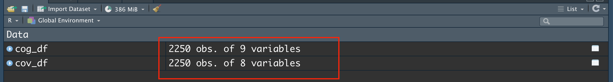
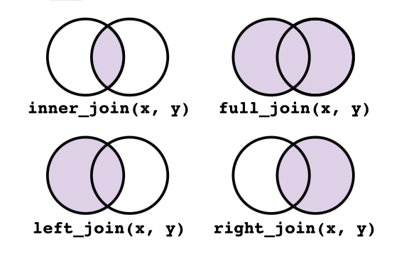

```{r setup, include=FALSE}
knitr::opts_chunk$set(echo = TRUE)
options(htmltools.dir.version = FALSE,
        htmltools.preserve.raw = FALSE)
```

# Reminder

- What we will talk about next usually can take 1-2 whole sessions for a master program in order to understand the techical details. Today the main purpose is to go through the tasks that R are capable of solving. 

--

- R studio is very user-friendly. Whenever you have problem with a function, just type "?" + `function()`. For example:

```{r, eval=FALSE}
?summary
?lm
?data.frame

```
--->R Studio

--

- If possible, please follow alone with your computer, welcome to ask question at any time.

---

# Data

The example data we use are `paquid_cog.csv` and `paquid_cov.csv`.

--

## Load package

we can load the package by using `library()` function.
- `tidyverse`: A powerful package for data wrangling, which I will show later.
- `Hmisc`: We need this package for adding label to data.frame().

```{r import package, message=FALSE}
library(tidyverse)
library(Hmisc)
```

--

## Import data

There are many different functions to read data, depending on the file's type. Since we have csv file, we can use `read.csv()` to read the data.

```{r}
cog_df <- read.csv(file = "data/paquid_cog.csv")
cov_df <- read.csv(file = "data/paquid_cov.csv")
# Use ?read.csv() to check what other arguments you can put in
```

---

# Explore data

Usually the first thing we need to do is to check if the data are **correctly imported**.

- Looking at the `Data` panel


--

- Use `str()` function to check if the column types are as expected.

```{r}
# check data's type
str(cog_df)
```

---

# Explore data

```{r}
# check data's type
str(cov_df)
```


--

- Here we can see the data types are as expected.
- However, there is a non-sense column "X", we need to get rid of it. The easiest way to use `select()` function from `tidyverse` package.

```{r}
# get rid of the first column 'X'
cog_df <- cog_df %>% select(-X) 
cov_df <- cov_df %>% select(-X)
```

---

# Explore data

- Use `head()` function to check the first few rows of dataframe

```{r}
head(cov_df)
```

- Use `class()` function to check the type of cov_df: Is it a matrix, or data.frame, or list, or tibble? 

```{r}
class(cov_df)
```

--

Personally I would love to convert `data.frame` to `tibble` for data wrangling.  --> R studio...

---

# Explore data

We may also interested in checking the descriptive statistics: `summary()`

```{r}
# descriptive statistics
summary(cog_df)
```


---

#	Generate and label variables

1.	Generate a variable “fu”, which means follow-up time and equals to age - age_init

* Let's first review cov_df:

```{r}
head(cov_df)
```

* How do we extract a specific column? By Google you can find many ways, one of them is to use `$` sign. "[1:10]" means take the elements one to ten.
```{r}
cov_df$age_init[1:10]
```

---
#	Generate and label variables

1.	Generate a variable “fu”, which means follow-up time and equals to age - age_init

* Now we are ready to generate the new variable:

```{r}
fu <- cov_df$age - cov_df$age_init
# if you want to add the new variable to dataframe
cov_df$fu <- fu
head(cov_df)
```

---

#	Generate and label variables
2.Generate a variable “dem_young”, which means age of dementia onset (variable “agedem”) ≤70 years old (use the the if/else statement).

--

```{r ,highlight.output=c(3,2)}
dem_young <- ifelse(cog_df$agedem <= 70, yes = 1, no = 0) 
# put dem_young to cog_df
cog_df$dem_young <- dem_young
head(cog_df)
```

---

#	Generate and label variables
3.**Rename** variable “CEP” as “education” and change the variable class to **factor**. **Label** the variable values as 0=“Below primary school”, 1=“Primary school and above”.

--

* We can rename a specific column "CEP" as follows:

```{r}
colnames(cov_df)[colnames(cov_df) == "CEP"] <- "education"
head(cov_df)
```

---

#	Generate and label variables
3.**Rename** variable “CEP” as “education” and change the variable class to **factor**. **Label** the variable values as 0=“Below primary school”, 1=“Primary school and above”.

* To label the variable we need to use the fore-mentioned `Hmisc` package. 

--

Actually this is also new for me...

--


```{r}
label(cov_df[["education"]]) <- "0='Below primary school', 1='Primary school and above'"
```

--

And then you can use View panel to check the label in the dataset. ---> R Studio.

---


#	Merge and reshape data sets

4.**Merge** datasets “paquid_cog” and “paquid_cov” to a data frame named “paquid”.

--

* With `join_` function: There are 4 common types of joins.





---

#	Merge and reshape data sets

4.**Merge** datasets “paquid_cog” and “paquid_cov” to a data frame named “paquid”.

```{r}
paquid <- full_join(x = cog_df, y = cov_df, by = c("ID", "wave", "age"))
head(paquid)
```


--

* With `merge` function:


---

# Ending

- At first you may feel difficult. But don't worry, R has a strong user community, basically you can solve most of the problems by Google. After using R several years, I still rely heavily on Google and I keep learning new things.


